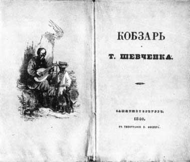

#Рання творчість Т. Шевченка

<table>
  <tr>
    <td colspan="2">
      
<b>Перше видання «Кобзаря»</b>

    </td>
  </tr>
  <tr>
    <td colspan="2">
      
18 квітня 1840 року

    </td> 
  </tr>
  <tr>
    <td colspan="2">
      У <b>Петербурзі; рукопис до друку підготував Є. Гребінка</b> (у лютому вийшов цензурний дозвіл на друк за підписом П. Корсакова).  
До збірки ввійшло <b>8 творів</b>: 
«Думи мої, думи мої...», 
«Перебендя», 
«Катерина», 
«Тополя», 
«Думка» («Нащо мені чорні брови...»), 
«До Основ’яненка», 
«Іван Підкова», 
«Тарасова ніч».  

<b>Малюнок</b> до видання (кобзар із хлопчиком-поводирем) виконав <i>Василь Штернберг</i>. 

    </td>  
  </tr>
  <tr>
    <td>
      1841 року
    </td>
    <td>
      Виходить окремо друком поема «Гайдамаки».
    </td>  
  </tr>  
</table>  