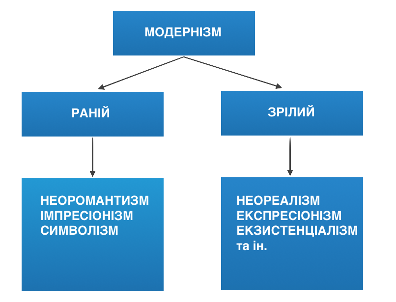

#МИХАЙЛО МИХАЙЛОВИЧ КОЦЮБИНСЬКИЙ – 
#«ВЕЛИКИЙ СОНЦЕПОКЛОННИК»

<i>Поезія не живе на смітнику, а без неї життя – злочин… 
М. Коцюбинський</i>

<b>Особливості стилю письменника</b> зумовлені ІМПРЕСІОНІЗМОМ як творчим методом. Імпресіонізм – напрям модернізму.
 

<b>Модернізм</b> (фр. <i>moderne</i> – сучасний, найновіший) – сукупність напрямів і течій кінця XIX – XX ст. неміметичного (нереалістичного) спрямування.

<b>Найзагальніші риси модернізму:</b>
<ul>
    <li>антипозитивізм, інтуїтивізм;</li>
<li>суб'єктивізм;</li>
<li>тяжіння до ірраціонального;</li>
<li>тяжіння до універсалізму.</li>
</ul> 

<b>Представники:</b>   
<ul>
    <li>Виник у Франції, невдовзі поширився в європейських літературах.</li>
<li>Ш. Бодлер, А. Рембо, П. Верлен, С. Малларме, М. Метерлінк, В. Брюсов, О. Блок й ін. </li>
<li>“Кити модернізму”: Дж. Джойс, М. Пруст,  Ф. Кафка.</li>
</ul> 

<b>Специфіка українського модернізму</b> 
<ul>
    <li>Постав на основі “філософії серця”.</li>
 <li>Розвивався в протистоянні до народництва (естетичний критерій – у центрі творчості).</li>
 <li>Соціально й національно ангажований.</li>
</ul>    

<b>Особливості стилю М. Коцюбинського</b> 
<ul>
   <li> фіксація миттєвих вражень – психічних порухів, душевних станів; </li>
<li>відсутність хронікального викладу, традиційного сюжету; </li>
<li>особлива ліризація, суб’єктивність; </li>
<li>поетика кольорів, живопИсність, світлотіні; </li>
<li>текст має підтексти, які треба декодувати; </li>
<li>надзвичайна вага художньої деталі – зорової, слухової, дотикової; </li>
<li>прийом кінематографічного монтажу кадрів, поліфонія; </li>
<li>сугестивний ефект творів; </li>
<li>синтез різних видів мистецтва: живопису, музики, літератури.</li>
</ul>    